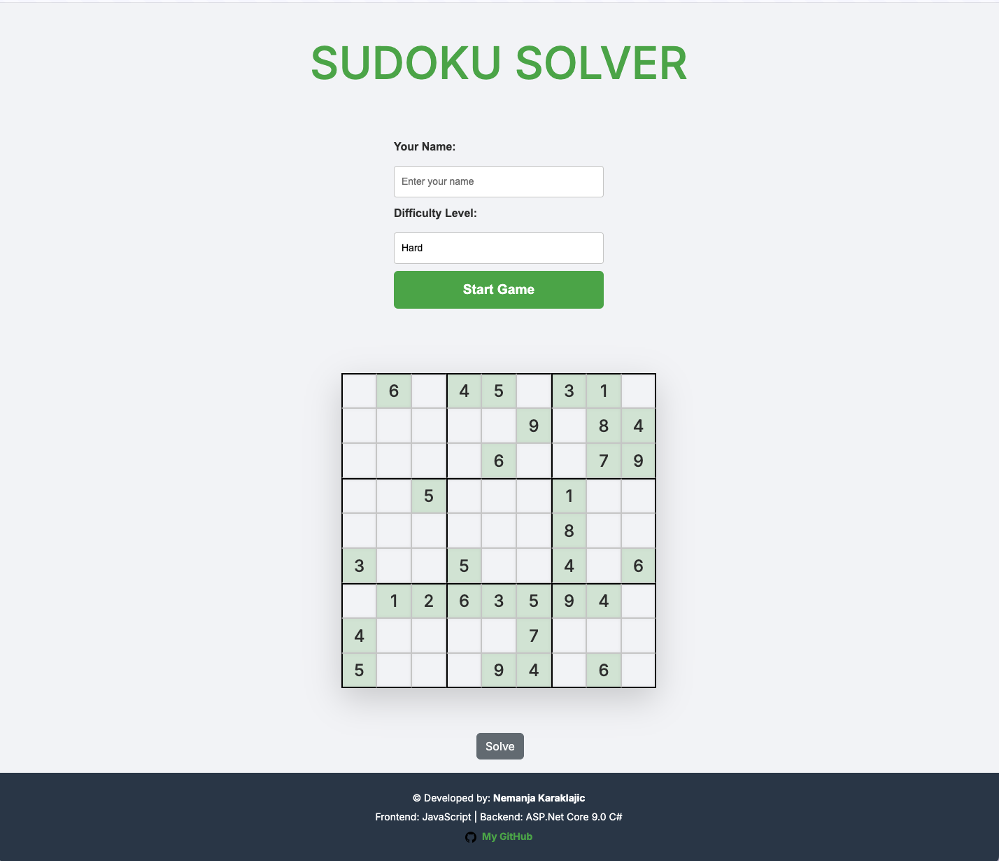

# Sudoku Solver

Sudoku Solver is an intuitive web-based application designed to solve Sudoku puzzles. Users can choose different difficulty levels, enter Sudoku puzzles, and get instant solutions. This project showcases both frontend and backend capabilities using modern technologies.

## 🚀 Features

- **Difficulty Levels**: Choose from `Easy`, `Medium`, or `Hard` Sudoku puzzles.
- **Interactive Input**: User-friendly interface to input or modify puzzle details.
- **Solution Generator**: Automatically solves the Sudoku puzzle in seconds.
- **Responsive Design**: Optimized for various screen sizes and devices.

## 🛠️ Technology Stack

### Frontend:
- **HTML5**, **CSS3**, **JavaScript**
- **Bootstrap 5**: For responsive layouts and UI components.
- **Google Fonts**: Integrated dynamic typography with "JetBrains Mono" and "Inter".

### Backend:
- **ASP.NET Core 9.0**: A modern and scalable backend framework (C#).

### Build Tool:
- **Vite**: Lightning-fast frontend tooling.

---

## 📦 Installation

1. **Clone the repository**:
   ```bash
   git clone https://github.com/letStayFoolish/sudoku-solver.git
   cd sudoku-solver
   ```

2. **Install dependencies**:
   ```bash
   npm install
   ```

3. **Run the development server**:
   ```bash
   npm run dev
   ```

4. **Build for production**:
   ```bash
   npm run build
   ```

---

## 📖 Usage

1. Open the application in your browser.
2. Input your **name** and select the desired **difficulty level**.
3. Adjust the Sudoku puzzle layout in the interactive grid.
4. Use the `Solve` button to generate the solution instantly.

---

[//]: # (## 📂 Project Structure)

---

## 📸 Screenshots

### Homepage
A user-friendly interface where players can select difficulty levels, start the game, and interact with puzzles.



---

## 🤝 Contributing

Contributions are welcome! Please follow these steps:

1. Fork the project.
2. Create your feature branch: `git checkout -b feature/NewFeature`.
3. Commit your changes: `git commit -am 'Add some feature'`.
4. Push to the branch: `git push origin feature/NewFeature`.
5. Submit a pull request.

---

## 📄 License

This project is licensed under the **MIT License**.

---

## 💻 Developer Information

- **Developer**: Nemanja Karaklajic
- **GitHub**: [@letStayFoolish](https://github.com/letStayFoolish)

---

## 🌟 Acknowledgements

- **Bootstrap**: For the responsive design framework.
- **Google Fonts**: For providing beautiful typography.

---
